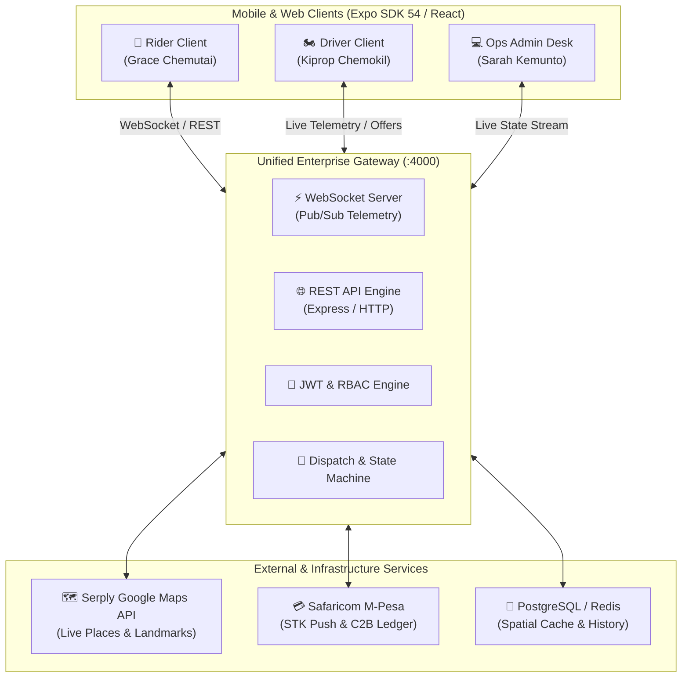

# Swift-Boda ⚡🏍️

> **Enterprise-Grade Real-Time Motorcycle (Boda Boda) Ride-Hailing & Fleet Dispatch Platform**  
> Tailored for hyper-local mobility, fast matching, live telemetry, and M-Pesa payments across Kenya.

---

## 🌟 Overview

**Swift-Boda** is a mission-critical, full-stack mobility ecosystem engineered specifically for the two-wheeler transport economy in East Africa. Built with **React Native / Expo SDK 54**, strict **TypeScript**, a resilient **Unified Node.js Gateway & WebSocket Server**, and integrated with **Live Serply Google Maps** and **Safaricom Daraja M-Pesa**.

### Core Pillars
- 📱 **Triple-Persona Architecture**: Seamless in-app switching between **Rider (Passenger)**, **Driver Partner**, and **Operations Admin Desk**.
- 🛰️ **Real-Time Cross-Device Synchronization**: Sub-second location broadcasting via WebSocket with automatic HTTP fallback and heartbeat recovery.
- 🔐 **4-Digit Safety PIN Handshake**: Cryptographic trip validation ensuring passengers only board authorized motorbikes.
- 🗺️ **Live Geospatial Navigation**: Real-time driver discovery, Leaflet / Native interactive maps, and landmark routing.
- 💰 **M-Pesa Financial Ledger**: Real-time fare calculation, STK Push integration, platform fee split (15% / 85%), and PDF receipt generation.
- 🔒 **Biometric & App-Lock Security**: Enforced PIN / FaceID / Fingerprint lock protecting driver earnings and rider wallets.

---

## 🏗️ System Architecture



---

## 🚀 Quick Start (< 5 Minutes)

### 1. Prerequisites
- **Node.js**: `v18.x` or `v20.x`
- **Package Manager**: `npm`
- **Android Development**: Android Studio, Android SDK 34+, and ADB configured in your `PATH`
- **Hardware / Emulation**: Physical Android device (USB or Wi-Fi) or Android Virtual Device (AVD)

### 2. Clone & Install Dependencies
```bash
# Clone the repository
git clone https://github.com/Akubrecah/swiftboda-ride.git
cd swiftboda-ride

# Install root dependencies
npm install
```

### 3. Environment Configuration
Copy the sample environment template and populate required keys:
```bash
cp .env.example .env
```
Ensure your Serply Maps API key is configured:
```env
SERPLY_API_KEY=your_serply_api_key_here
PORT=4000
NODE_ENV=development
```

### 4. Start the Unified Backend Gateway
In a terminal, launch the gateway server with live WebSocket telemetry:
```bash
npm run start:gateway
# Server starts on http://localhost:4000 and ws://localhost:4000
```
Verify the server health:
```bash
curl http://localhost:4000/api/v1/health
# Response: {"status":"UP","service":"Swift Boda Unified Enterprise Gateway", ...}
```

### 5. Launch Mobile Application
For testing on physical Android devices connected via USB:
```bash
# Set up reverse port forwarding so your phone reaches local services
adb reverse tcp:4000 tcp:4000
adb reverse tcp:8081 tcp:8081

# Start Metro bundler
npx expo start

# Or compile and install the standalone debug APK directly
cd android && ./gradlew assembleDebug
adb install -r app/build/outputs/apk/debug/app-debug.apk
```

---

## 👥 Verified Pilot Accounts (West Pokot Hub)

The system comes pre-seeded with operational credentials ready for immediate pilot testing:

| Persona | Name | Phone Number | Default OTP | Role / Vehicle |
| :--- | :--- | :--- | :--- | :--- |
| **Rider** | Grace Chemutai | `0712345001` | `123456` | Passenger (Makutano Hub) |
| **Driver** | Kiprop Chemokil | `0712345678` | `123456` | Boxer 150X (`KMDK 234P`) |
| **Driver** | Pkemoi Rotich | `0722334455` | `123456` | TVS HLX 150 (`KMDF 891B`) |
| **Admin** | Sarah Kemunto | `0700000001` | `123456` | Operations Central Desk |

> 🔑 **Security Unlock PIN**: `1234` (or biometric unlock on supported devices).

---

## 🔄 Cross-Device Ride Lifecycle Walkthrough

To verify end-to-end multi-device coordination:

1. **Driver Goes Online**:
   - Open Device 1 → Log in as Driver (`0712345678`).
   - Toggle **"Go Online"**. Live GPS coordinates stream to Gateway every 3 seconds.
2. **Rider Discovers Driver**:
   - Open Device 2 → Log in as Rider (`0712345001`).
   - The driver's motorbike icon appears moving on the interactive map.
3. **Ride Request**:
   - Select destination (e.g. *Kapenguria District Hospital*) → Tap **"Request Boda"**.
   - Gateway creates trip `#TRIP-XXXX` in `SEARCHING_DRIVER` status.
4. **Incoming Offer**:
   - Device 1 (Driver) rings with an audible incoming offer modal and 15s timer.
   - Driver taps **"Accept Ride"**. Trip transitions to `DRIVER_ASSIGNED`.
   - Rider's screen instantly updates with Kiprop's name, bike model, plate, and phone.
5. **Arrival & Safety PIN Handshake**:
   - Driver taps **"Arrived at Pickup"** → Rider screen updates to `DRIVER_ARRIVED`.
   - Rider provides the 4-digit PIN (e.g. `5432`) displayed on their screen.
   - Driver enters the PIN → Server validates → Trip transitions to `IN_TRIP`.
6. **Completion & Receipt**:
   - Driver taps **"Complete Trip"** → Transitions to `COMPLETED`.
   - Rider can rate the driver, tip, and export an official PDF receipt.
7. **Admin Monitoring**:
   - Open Admin Desk (`LIVE_OPS` tab) on any device to audit active trips and connected fleet telemetry in real time.

---

## 📡 API & Real-Time Telemetry Specification

### Core Endpoints

| Method | Endpoint | Description |
| :--- | :--- | :--- |
| `GET` | `/api/v1/health` | Gateway readiness probe & status |
| `POST` | `/api/v1/driver/telemetry` | Ingest driver GPS coordinates, heading & online status |
| `GET` | `/api/v1/drivers/online` | Query available fleet filtered by category |
| `POST` | `/api/v1/trips` | Dispatch new trip request across online drivers |
| `GET` | `/api/v1/driver/offers` | Real-time pending offer queue for driver |
| `POST` | `/api/v1/trips/:tripId/accept` | Driver atomically accepts ride offer |
| `PUT` | `/api/v1/trips/:tripId/status` | Advance trip state (`DRIVER_ARRIVED`, `IN_TRIP`, `COMPLETED`, `CANCELLED`) |
| `GET` | `/api/v1/admin/live-state` | Real-time active trips & fleet telemetry for dispatchers |
| `GET` | `/api/v1/maps/places/search` | Query live places and landmarks via Serply API |

---

## 📂 Project Structure

```text
swiftboda/
├── android/                 # Native Android project configuration & Gradle scripts
├── app/                     # Expo Router file-based application screens
│   ├── (tabs)/              # Main application tabs (Home, Explore, Wallet, Profile)
│   ├── _layout.tsx          # Root tab navigation and modal shell
│   └── modal.tsx            # Fullscreen modal router
├── assets/                  # High-density icons, splash screens, and brand imagery
├── components/              # Modular UI components (MapView, AuthModal, SecurityLock)
├── context/                 # Application state (SwiftBodaContext, ThemeContext)
├── gateway/                 # Enterprise Unified Gateway Server (server.ts)
├── packages/                # Monorepo packages & shared utilities
├── services/
│   ├── config/              # Centralized environment & credentials manager
│   ├── database/            # Resilient persistence engine & pilot seeds
│   ├── maps-service/        # Serply Google Maps engine & fallback resolvers
│   ├── realtime/            # Universal SyncClient (WebSocket + HTTP Polling)
│   ├── receiptPdfService.ts # Digital PDF receipt generator
│   └── trip-service/        # Trip lifecycle & state machine
├── shared/                  # Universal types, constants, geo math, and region seeds
├── styles/                  # Clean CSS-in-JS style system with theme support
├── tests/                   # Automated integration and unit test suites
├── TASKS.md                 # Project backlog & Vibe Coding execution tracker
└── README.md                # Project documentation
```

---

## 🧪 Testing & Verification

Execute the following verification suites before any code commit:

```bash
# 1. Type Safety Check (Zero errors required)
npx tsc --noEmit

# 2. Code Linting
npm run lint

# 3. Dynamic Pricing Model Tests
npm run test:pricing

# 4. Serply Google Maps Integration Tests
npm run test:serply
```

---

## 🛡️ Security & Compliance

- **Zero Hardcoded Secrets**: All sensitive keys (`SERPLY_API_KEY`, `JWT_SECRET`, M-Pesa Consumer Keys) are loaded via environment variables and ignored from Git.
- **Server-Side Authorization**: Fare adjustments, ride PIN verification, and driver assignments are executed and validated exclusively on the gateway server.
- **Data Protection**: Personal passenger phone numbers are masked in transit.

---

## 📄 License

This project is licensed under the **MIT License** — see the [LICENSE](./LICENSE) file for details.
